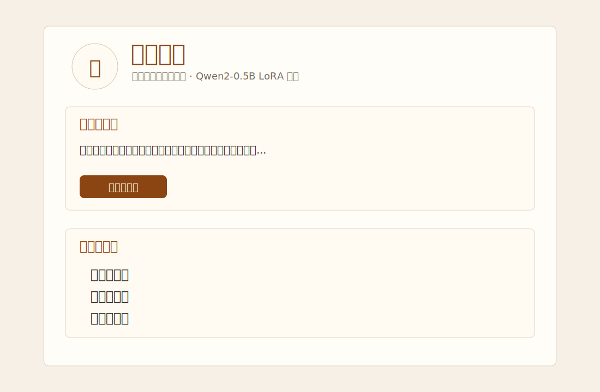
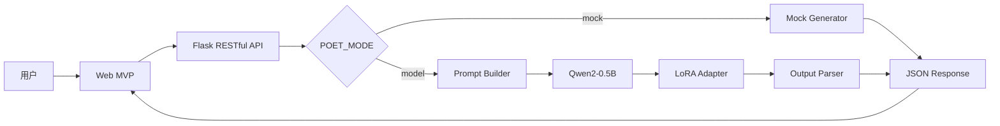

# Qwen-Poet：基于 Qwen2-0.5B LoRA 的白话文转古诗文产品

> AI 产品经理作品集项目。围绕“白话文转古诗文”的垂直生成场景，完成从用户需求、数据构建、LoRA 微调、Benchmark 评测到 Web MVP 交付的完整链路。作者展示名：JZ。



## 项目一句话介绍

Qwen-Poet 是一个基于 Qwen2-0.5B + LoRA 微调的古诗文生成产品。用户输入现代白话文，系统输出更具古典诗意和分行结构的古风文本。

## 项目亮点

- **AI 产品完整链路**：需求分析、数据集构建、模型微调、评测体系、Web MVP、RESTful API。
- **垂直场景 LLM 应用**：面向古诗文创作与传统文化内容生成，而不是通用聊天 Demo。
- **LoRA 微调落地**：基于 Qwen2-0.5B，使用 2,018 条原文-译文数据进行领域适配。
- **Benchmark 评测闭环**：对比微调前模型、RNN、LSTM 基线，并结合 BLEU、ROUGE-L、Perplexity 与 12 名用户评测。
- **可运行 Web MVP**：Flask + RESTful API + 前端交互，支持 Mock 模式和真实模型模式。

## 用户痛点与场景

古诗文创作门槛高，普通用户难以将现代语义转化为凝练、典雅、有意境的古典表达。Qwen-Poet 面向以下场景：

- 古诗文学习：理解白话语义到古典表达的转换方式。
- 内容创作：生成古风标题、短文案、诗性表达。
- 教育演示：辅助课堂讲解和作业启发。
- AI 产品展示：呈现从模型到产品的落地能力。

## 产品核心功能

1. 白话文输入与长度校验。
2. 预设示例，降低首次使用门槛。
3. 古诗文生成与分行展示。
4. 复制结果与竖排展示。
5. Mock 模式：无模型权重也能体验产品。
6. Model 模式：本地加载 Qwen2-0.5B + LoRA Adapter。

## Product Workflow

```text
用户输入白话文
  -> Web 前端提交 /simple_generate
  -> Flask API 校验请求
  -> 构造 Qwen Chat Prompt
  -> Qwen2-0.5B + LoRA Adapter 推理
  -> 输出后处理
  -> 前端展示古诗文结果
```

## 系统与模型架构



## 数据集构建

训练数据围绕“白话译文 -> 古诗文正文”构造，共整理 2,018 条原文-译文样本。

字段包括：

- `title`：标题
- `dynasty`：朝代
- `author`：作者
- `input`：白话文/译文
- `output`：古诗文正文

数据处理流程：采集公开古诗文文本与译文、清洗注释和格式噪声、构造监督微调样本、转换为 Qwen Chat 格式。

## LoRA 微调方案

- Base Model: `Qwen/Qwen2-0.5B`
- Fine-tuning: LoRA / PEFT
- Task Type: `CAUSAL_LM`
- Target Modules: `q_proj`, `k_proj`, `v_proj`, `o_proj`, `gate_proj`, `up_proj`, `down_proj`
- Rank: `r=8`
- Alpha: `32`
- Dropout: `0.1`
- Training Batch Size: `4`
- Gradient Accumulation: `4`
- Learning Rate: `1e-4`
- Evaluation Strategy: steps

## Prompt Engineering

推理使用 Qwen Chat 格式，通过 system prompt 明确角色、风格和输出结构：

```text
你是一位精通古典诗词写作的文人，擅长用简洁典雅的语言表达深远意境。
请将用户提供的白话文改写为古风诗文，风格高古，用词讲究，每句独立成行。
```

这个设计用于减少散文化解释，让输出更接近可展示、可复制的古诗文结果。

## Benchmark / 模型评测

| 指标 | 微调前 | LoRA 微调后 | 提升 |
|---|---:|---:|---:|
| BLEU | 0.45 | 0.60 | +33.3% |
| ROUGE-L | 0.38 | 0.55 | +44.7% |
| Perplexity | 110 | 85 | -22.7% |

评测体系同时包含 RNN、LSTM 基线对比和 12 名用户评测，从自动指标与主观可用性两侧验证生成质量。

## 本地运行

### 1. 安装依赖

```bash
cd Qwen-Poet-GitHub
python -m venv .venv
.venv\Scripts\activate
pip install -r requirements.txt
```

### 2. Mock 模式运行

```bash
copy .env.example .env
python app/app.py
```

访问：`http://127.0.0.1:5000`

Mock 模式不需要模型权重，适合快速查看前端和 API 流程。

### 3. 真实模型模式

准备本地模型：

```text
Qwen2-0.5B/
model_adapter/qwen2-0.5b-poetry-lora/
```

修改 `.env`：

```ini
POET_MODE=model
BASE_MODEL_PATH=./Qwen2-0.5B
LORA_ADAPTER_PATH=./model_adapter/qwen2-0.5b-poetry-lora
```

运行：

```bash
python app/app.py
```

## 项目结构

```text
Qwen-Poet-GitHub/
  README.md
  requirements.txt
  .gitignore
  .env.example
  LICENSE
  app/
  notebooks/
  scripts/
  data/
  evaluation/
  model_adapter/
  assets/
  docs/
  tests/
```

## 我的职责

JZ 负责该项目从 0 到 1 的完整落地：需求定义、用户场景拆解、数据构建、Qwen2-0.5B LoRA 微调、Benchmark 评测、Flask API、Web MVP 与 GitHub 公开版整理。

## 后续规划

- 将 LoRA Adapter 发布到 Hugging Face。
- 增加在线 Demo 部署。
- 增加更多题材控制，如山水、咏物、送别、边塞等。
- 增加人工偏好评测页面，沉淀用户反馈闭环。
- 扩展为“古风文案生成 + 诗文改写 + 风格选择”的完整 AIGC 工具。

## 技术栈

Python, Flask, RESTful API, Qwen2-0.5B, Transformers, PEFT/LoRA, PyTorch, Pandas, Jupyter Notebook, HTML/CSS/JavaScript。

## 数据与模型说明

代码采用 MIT License。完整训练数据、基座模型权重和 LoRA Adapter 不直接放入 GitHub 仓库；模型权重建议通过 Hugging Face 或 Git LFS 独立管理。
